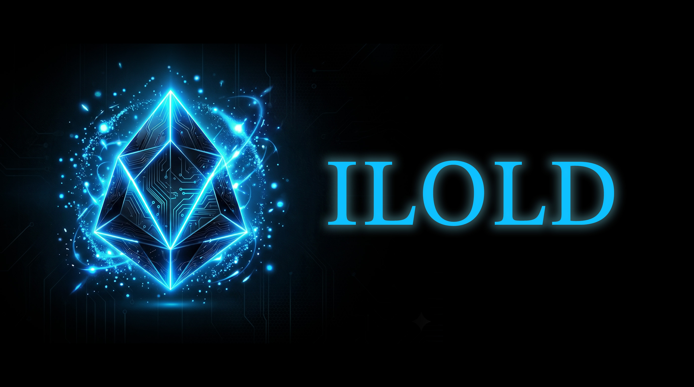
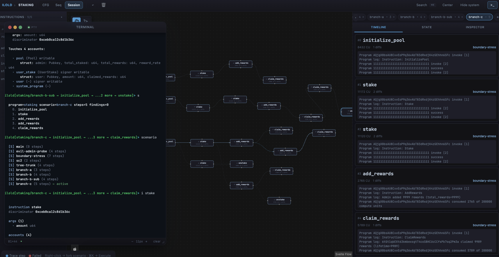
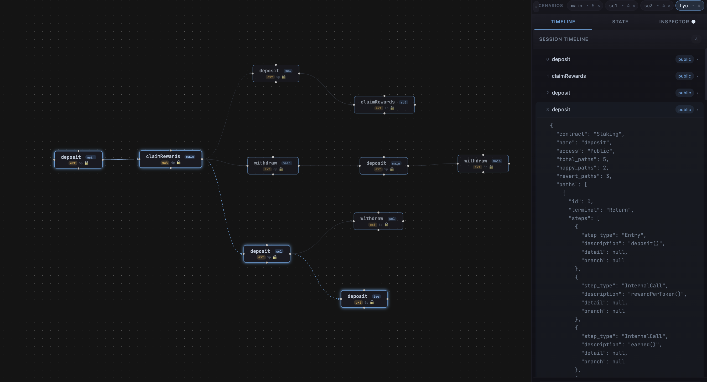
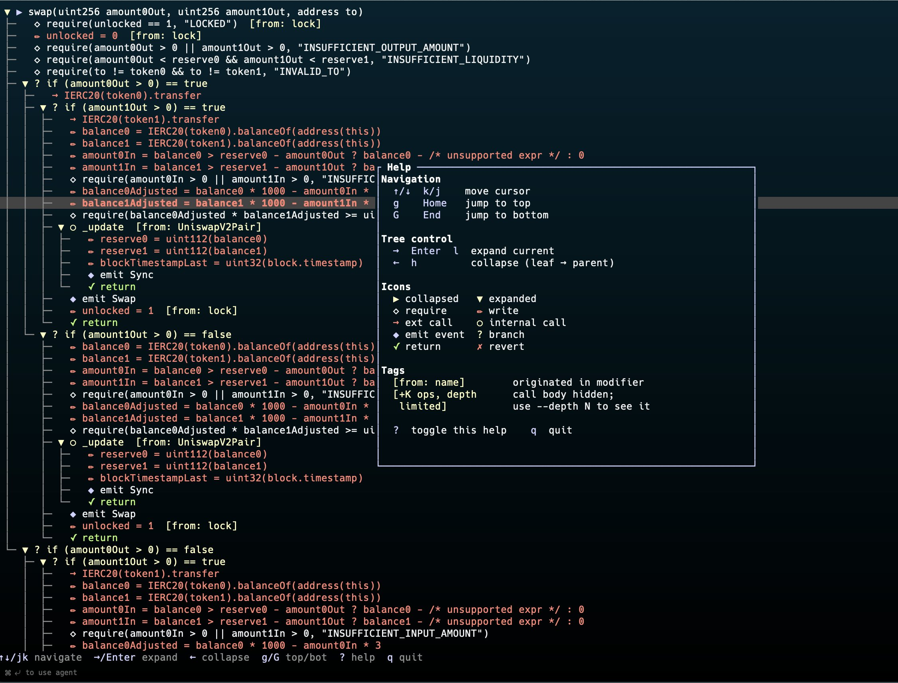

# ilold

Execution path analyzer and interactive security workbench for smart contracts. It maps every possible path through a protocol (every branch, function combination, and state mutation) and lets users navigate them visually, branch by branch, with an LLM reasoning over each path.



## What it does

ilold loads a smart contract project, builds an in-memory model, and drops the auditor into an interactive REPL backed by a live web canvas. Each command answers a question about the protocol: list entry points, add a call to a session, inspect state changes, trace execution flow, slice data dependencies, record findings, export a report. The canvas reflects the same state in a visual graph that the user navigates by clicking, expanding and forking.

Two backends, one shell:

| Backend | Input | Execution model |
| --- | --- | --- |
| Solana | Anchor project (`Anchor.toml` + IDL + `.so`) | Concrete execution on LiteSVM with scenario forking |
| Solidity | `.sol` sources | Static analysis: parser, CFG, path tree, slicer |

The Solana backend also ships a Model Context Protocol (MCP) server so an LLM agent can drive the audit end to end while the canvas reflects every step in real time.

## Quick start

Build from source:

```
git clone https://github.com/scab24/ilold.git
cd ilold
cargo build --release
```

The binary is at `target/release/ilold` with four subcommands: `analyze`, `context`, `serve`, and `explore`.

## Solana backend

Anchor programs execute against a LiteSVM-backed engine. Every `call` runs the compiled program in the VM, so the auditor sees real compute units, real logs, and real account state. Scenarios can be forked from any step and replayed deterministically with `save --with-keypairs` / `load`.



```
./target/release/ilold explore tests/fixtures/solana/staking --port 8080
```

Then in the REPL:

```
ilold[staking]> f
ilold[staking]> info stake
ilold[staking]> users new alice
ilold[staking]> c stake amount=1000 pool=pool user_stake=alice_stake user=alice
ilold[staking]> state
ilold[staking]> coverage
ilold[staking]> finding High "..."
ilold[staking]> export
```

### LLM-driven audit (Solana via MCP)

Register the MCP server once in your client:

```
claude mcp add ilold --transport stdio -- \
  ./target/release/ilold mcp --server-url http://127.0.0.1:8080
```

Then ask the LLM in natural language:

> Audit the active Solana program. Map the surface, set up a realistic scenario, probe whatever attack vectors come to mind, and hand me the deliverable at the end.

The LLM picks the right tools, the backend executes them in LiteSVM, and the canvas reflects each step in real time. The MCP server is agnostic to the active program: a single registration works against multi-program workspaces, the LLM switches with `ilold_use <program>`.

## Solidity backend

Contracts are parsed into a typed model. Per-function CFGs and path trees drive the interactive analysis commands: `info`, `trace`, `slice`, `timeline`, and sequence narratives.



```
./target/release/ilold explore tests/fixtures/staking.sol
```

```
ilold[Staking]> f
ilold[Staking]> c deposit
ilold[Staking → deposit]> s
ilold[Staking → deposit]> who totalStaked
ilold[Staking → deposit]> sl deposit totalStaked
ilold[Staking → deposit]> tr deposit
```

For one-shot static analysis without the REPL:

```
./target/release/ilold analyze tests/fixtures/staking.sol --max-seq-depth 5
```

## Trace and slice (Solidity)

`trace` builds the full execution tree of a function with modifier bodies inlined, requires highlighted, state writes flagged, and external calls marked. `slice` produces backward and forward dataflow slices for any variable in any function. Both are static and only available on the Solidity side today; Solana coverage is reconstructed at runtime via `coverage` and the runtime overlay until the AST + CFG layer lands (see [Roadmap](docs/guide/src/roadmap/solana.md)).



## Documentation

Full reference, walkthroughs and HTTP API are in [`docs/guide/`](docs/guide/src/SUMMARY.md). Build the book locally with:

```
mdbook serve docs/guide --open
```

Key pages:

- [Introduction](docs/guide/src/introduction.md)
- [Getting Started](docs/guide/src/getting-started.md)
- [Solana Backend](docs/guide/src/solana/overview.md)
- [Solidity Backend](docs/guide/src/solidity/overview.md)
- [MCP server](docs/guide/src/reference/mcp.md)
- [Roadmap](docs/guide/src/roadmap/solana.md)

## Status

MVP scope shipped:

- Typed graph from Anchor IDL (Solana) and `solar-compiler` AST (Solidity)
- Executable scenarios with fork from any step, save/load, runtime overlay
- LLM-aware REPL with structured `?` help per command
- MCP server with 30 typed tools agnostic to the active program
- Source viewer parity Solana - Solidity with "open in IDE" deep links
- Markdown audit deliverable with severity matrix and methodology

Documented future work (see [Roadmap](docs/guide/src/roadmap/solana.md)):

- AST + CFG layer on the Solana side via Elozer, our in-house static analyzer
- Detector engine measured against the public sealevel-attacks corpus
- Pre-built attack-pattern query catalog
- MCP server for the Solidity backend

## Project layout

Single Rust monorepo:

```
crates/
  ilold-cli           Interactive shell + analyze/context CLI
  ilold-solana-core   Solana engine (Anchor IDL + LiteSVM + runtime overlay)
  ilold-core          Solidity engine (parser, CFG, path tree, slicer)
  ilold-session-core  Shared session, scenarios, findings, export
  ilold-web           REST + WebSocket server (Svelte frontend inside)
  ilold-mcp           MCP server for LLM agent integration
  ilold-render        Pretty printers shared by CLI and MCP
  ilold-help          Tool registry shared by REPL help and MCP
tests/
  fixtures/           Anchor + Solidity Foundry fixtures (binaries committed)
  scenarios/          Bash + Python end-to-end suite
docs/guide/           Public mdbook documentation
```

## License

ilold is licensed under the [GNU Affero General Public License v3](LICENSE). The AGPL section 13 (remote network interaction) applies: if you run a modified version of ilold on a network server, you must offer the modified source to users of that server.

Copyright (C) 2026 scab24.

---

Built with Rust, Svelte 5, `@xyflow/svelte`, LiteSVM, `solang-parser`, Anchor IDL, and `rmcp`.
