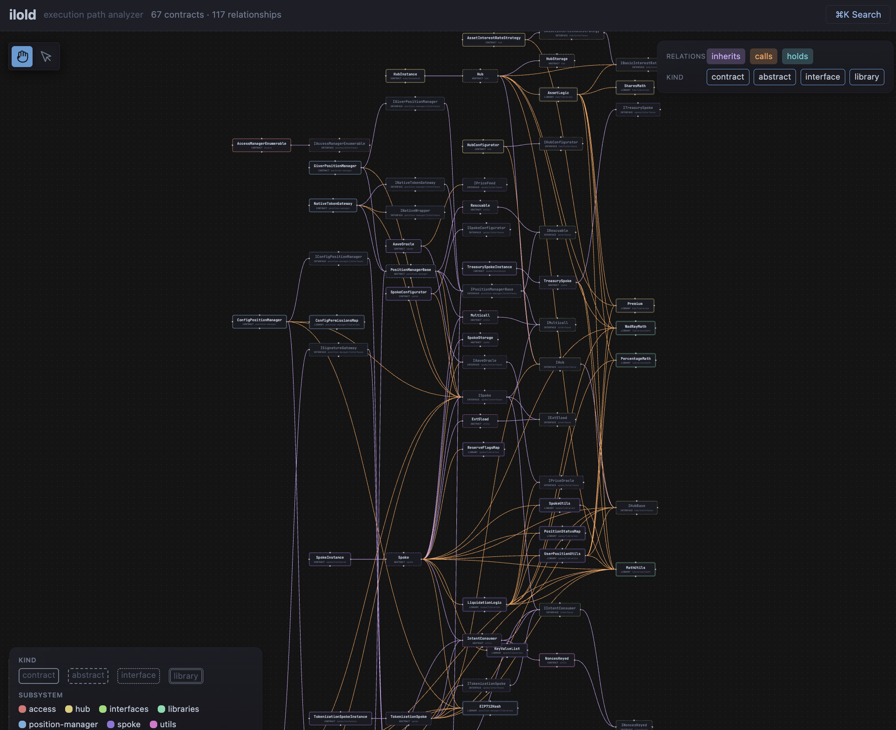

# ilold

An interactive tool for auditing Solidity smart contracts. It compiles the contracts with solc, maps how they relate to each other, and exposes execution paths through a REPL and a web canvas.


## What it does

ilold compiles the contracts with solc and builds a model of the whole project. The model is explored from a REPL, with the web canvas open alongside. Call sequences are built step by step; the tool reports how state changes across them, traces a function's execution, slices a variable's data flow, and maps how contracts depend on each other. Findings are recorded during the session and exported as a markdown report.

Because it reads the solc AST, ilold knows the real target of a cross-contract call. A call through `IPool pool; pool.supply()` is attributed to `IPool.supply`. The dependency graph is built from that.

## Quick start

```
git clone https://github.com/scab24/ilold.git
cd ilold
cargo build --release
```

The binary is at `target/release/ilold` with four subcommands: `analyze`, `context`, `serve`, and `explore`.

## The dependency graph

ilold maps how a protocol fits together with three relationships:

- `inherits`: a contract extends another.
- `calls`: a function calls into another contract, resolved to the real target.
- `holds`: a contract has a state variable of another contract's type.

Cycles are grouped and contracts are sorted into reading order, so foundational contracts come first. The graph is the home view of the canvas. Color encodes the subsystem and line color the relationship. Hovering a contract highlights its relationships, and the toggles filter by relation or kind.



In the REPL, `deps <contract>` lists what a contract depends on and `usedby <contract>` lists what depends on it. The same map is available as a one-shot CLI command:

```
./target/release/ilold analyze tests/fixtures/solc/cross --deps
```

## Exploring a contract

```
./target/release/ilold explore tests/fixtures/staking
```

```
ilold[Staking]> c deposit
ilold[Staking → deposit]> s
ilold[Staking → deposit]> who totalStaked
ilold[Staking → deposit]> sl deposit totalStaked
ilold[Staking → deposit]> tr deposit
```

The canvas opens with the REPL and shows the same model: the call graph, the control flow of a function, and the session being built.


## Commands at a glance

| Group | Commands |
| --- | --- |
| Session | `call`, `back`, `clear`, `state`, `sequence`, `step`, `session` |
| Analysis | `who` (reads/writes of a variable), `info` (function detail), `trace` (execution tree), `timeline` (mutations across steps), `slice` (data flow) |
| Contract | `functions`, `vars`, `contracts`, `deps`, `usedby`, `use` |
| Findings | `finding`, `note`, `scenario`, `status`, `findings`, `export` |
| Workspace | `save`, `load`, `browser`, `quit` |

Appending `?` to any command prints its usage. Sessions can be named, forked into scenarios, and saved or loaded across runs.

## Trace and slice

`trace` shows the execution tree of a function with modifier bodies inlined, and requires, state writes, and external calls marked. External calls are resolved to their real target. `slice` shows the backward and forward data flow of a variable in a function.


## Documentation

The documentation sources are in [`docs/guide/`](docs/guide/src/SUMMARY.md). To build and read them locally:

```
mdbook serve docs/guide --open
```

Key pages:

- [Introduction](docs/guide/src/introduction.md)
- [Getting Started](docs/guide/src/getting-started.md)
- [Contract Commands](docs/guide/src/commands/contract.md)
- [Mapping a Codebase](docs/guide/src/workflows/dependency-mapping.md)
- [HTTP API](docs/guide/src/reference/api-endpoints.md)
- [Known Limitations](docs/guide/src/reference/limitations.md)

## Project layout

```
crates/
  ilold-cli    Interactive shell (explore) and the analyze/context CLI
  ilold-core   Solidity engine: solc frontend, model, CFG, path tree,
               call graph, dependency graph, slicer
  ilold-web    REST and WebSocket server with the Svelte canvas frontend
tests/
  fixtures/    Solidity fixtures, including solc/cross for cross-contract tests
scripts/       Verification scripts
docs/guide/    mdbook documentation
```

## License

ilold is licensed under the [GNU Affero General Public License v3](LICENSE). AGPL section 13 applies: running a modified version on a network server requires offering the modified source to its users.

Copyright (C) 2026 scab24.
